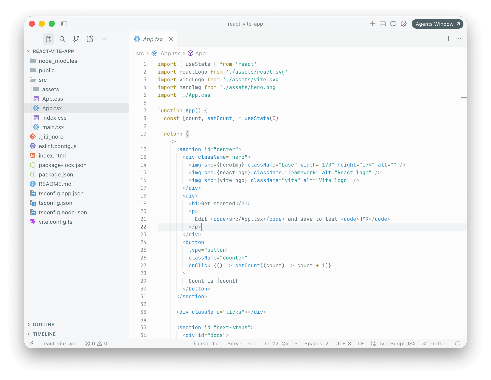

# Helios Theme

🚧 WIP

A clean, modern light theme for VS Code and VS Code-compatible editors.

## Installation

### Marketplace links

- [Visual Studio Marketplace](https://marketplace.visualstudio.com/items?itemName=rbika.theme-helios)
- [Open VSX Registry](https://open-vsx.org/extension/rbika/theme-helios)

### Install from editor

1. Open **Extensions** tab in your editor.
2. Search for `Helios Theme`.
3. Install the extension published by `rbika`.
4. Open **Preferences: Color Theme** and select `Helios Theme`.

## License

Distributed under the terms in [`LICENSE.txt`](./LICENSE.txt).
